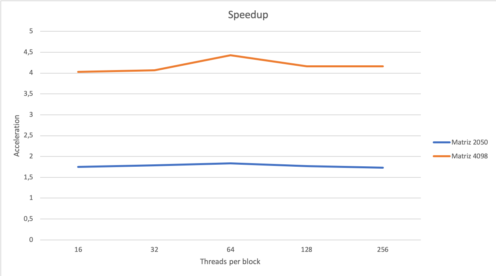

# Gauss Seidel using CUDA

This small project contains the implementation of the <a href="https://en.wikipedia.org/wiki/Gauss–Seidel_method">Gauss Seidel linear equations solver</a>, using <a href="https://en.wikipedia.org/wiki/CUDA">NVIDIA CUDA</a> for parallelizing computations using a GPU. The Gauss Seidel method for solving linear equations is an iterative method, in which the values for the given variables keep changing until a certain threshold of variance is reached.

The goal of this projet was to provide a faster resolution time than the sequential version of the code, which is also provided in the repository.

<br>

## How does it work?

### General considerations:

In order to parallelize the calculations, **ALL** data dependency constraints need to be omitted. This constraint relaxation will only mean that the *solver* function will take longer iterations to reach the predefined *threshold*. However, this is totally fine, as **the speed up that is achieved by parallelizing the calculations, is way higher than the cost of more iterations**.

### Parallelization steps:

<b>1. Decomposition:</b> as CUDA architecture favours fine grain parallelization, the computational unit is defined as all the iterations a CUDA thread needs to perform in order to achieve a value delta smaller than the threshold.

<b>2. Assignation:</b> the assignment is pretty clear: each matrix cell will be paired with a CUDA thread. However, given that CUDA threads are grouped in chunks of variable size: how many *threads per block* should we defined? (this will determine the required number of blocks for a given matrix size).

The formula to apply is the following one:

```C
int blocks_num = ceil((n-2) * (n-2) / threads_per_block)
```

<b>3. Orchestation:</b> first of all, the initial matrix needs to be copied from the host (CPU) to the device 8GPU) allowing the computations to begin. 

The orchestation between the different CUDA threads is literally zero: each thread is given a cell to transform, and no iteration is done between threads. There is a special case to consider though: **as whole groups of threads are raised, there may be the case that some threads from the last group are left with no cell to compute.**

Finally, the computed results are copied from device memory (GPU) to host memory (CPU).

<b>4. Mapping:</b> all CUDA threads are executed in the same device (GPU). No multi-GPU support is provided.

<br>

## What is in the repository?

The repository contains:

- <b>Sequential code version</b> (*gc_seq.cu*).
- <b>CUDA code version</b> (*gs_cuda.cu*).
- <b>Bash script:</b> for executing with multiple configurations (*exec_script.sh*).
- <b>Makefile:</b> used to compile and clean the project.

<br>

## Usage

First of all, **the NVCC compiler needs to be installed** ⚠️. Later on, the executable is generated by doing:

```shell
$ make
```

Once the code is compiled, it can receive 2 arguments:

- <b>Matrix size:</b> usually a power of 2 (64, 128, 256, 1024...).
- <b>Threads per block</b>: better a multiple of 32 (32, 64, 128...).

The execution command will be as follows:

```shell
$ ./gs_cuda <matrix_size> <threads_per_block>
```

Example:

```shell
$ ./gs_cuda 1024 64
```

<br>

## Results

As the whole goal of this project was to speed-up the resolution of the linear equation system, it is important to state the obtained acceleration. The speed-up values have been computed using the <a href="https://en.wikipedia.org/wiki/Amdahl%27s_lawAmdhals">Amdahl's law</a>:

<p align="center">
	
</p>

<br>

## Authors

This project was developped by:

[Sinclert Pérez](https://github.com/Sinclert)

[Silvia Barbero](https://github.com/fyrier)

[Pablo León](https://github.com/PLeon6822)

